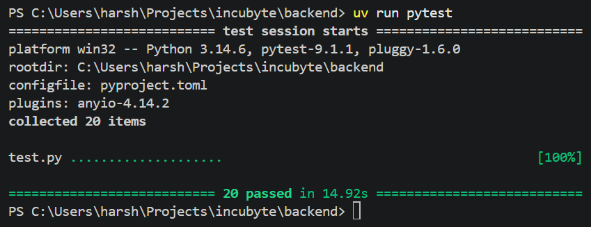
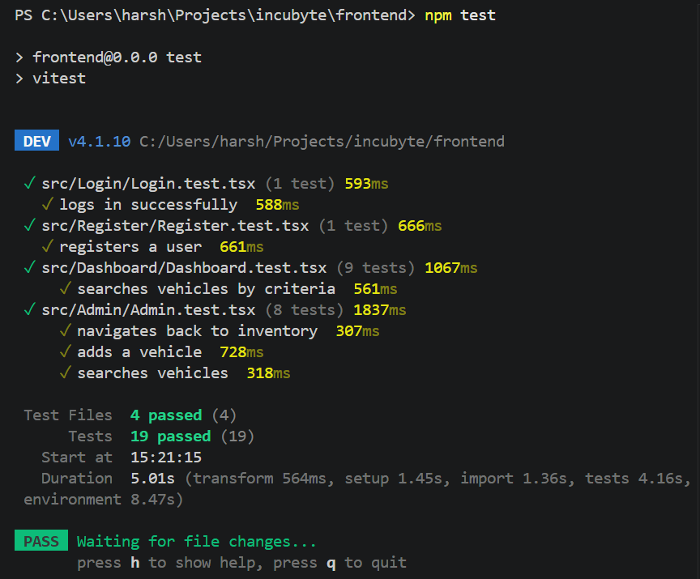
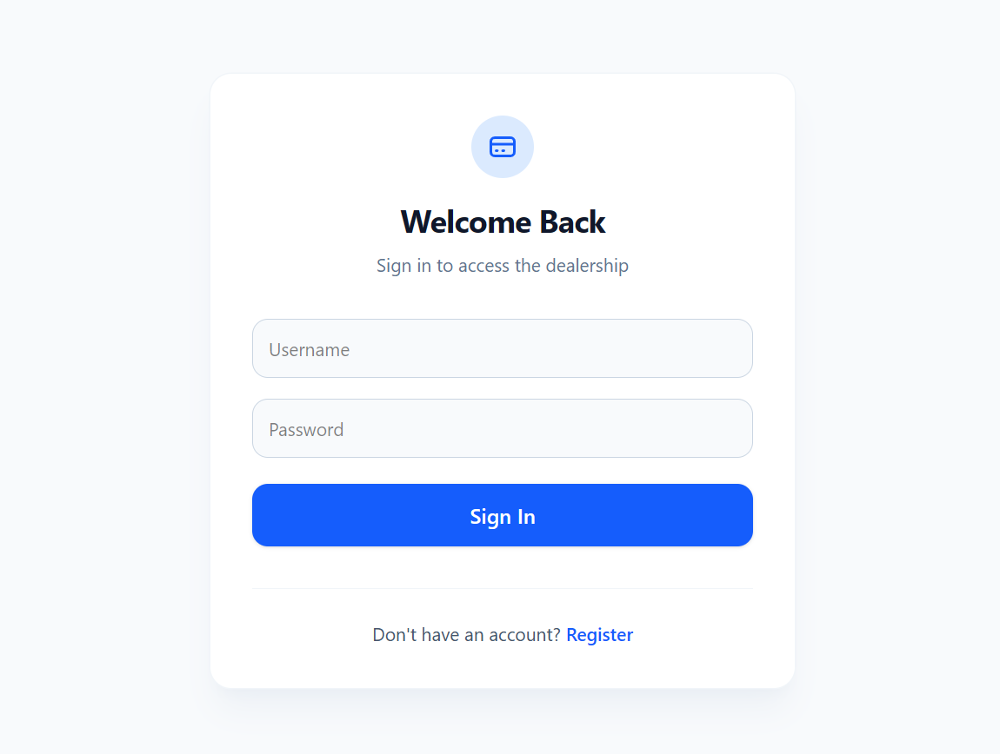
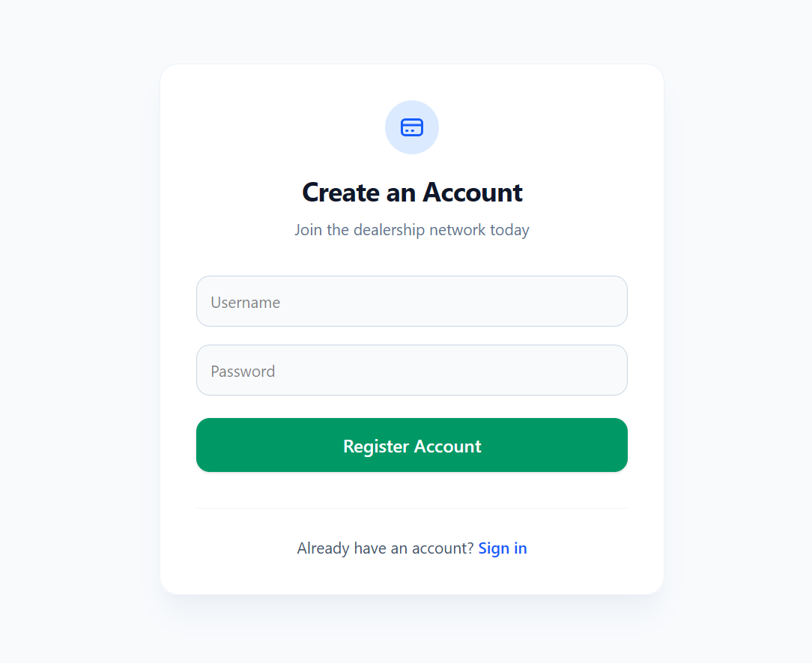
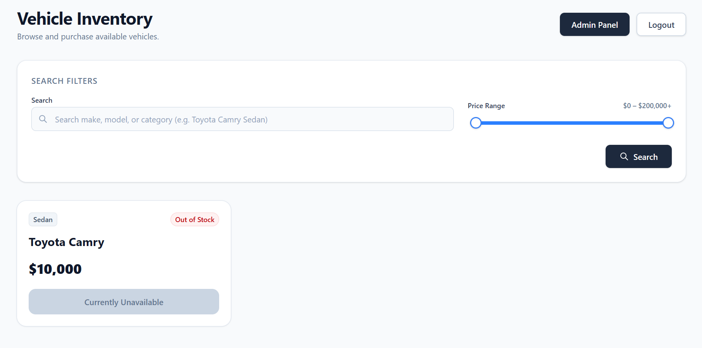
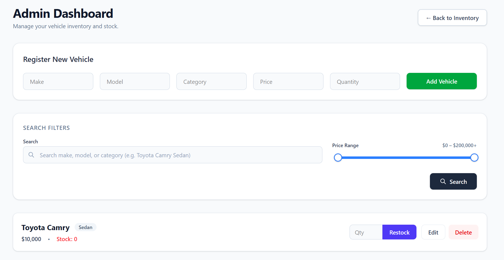

# Car Dealership Inventory System

A full-stack inventory management application for a car dealership, built with a FastAPI (Pytest + SQLite + SQLAlchemy) and React (Vite + TypeScript + Tailwind). Supports user authentication, role-based access control, vehicle CRUD, search/filtering, and purchase/restock inventory operations.

`https://incubyte-harshdeep.vercel.app/`

## Project Overview

This project implements:

- **Backend API** (FastAPI + SQLite via SQLAlchemy) exposing authentication and vehicle/inventory endpoints, secured with JWT-based authentication and admin-only route protection.
- **Frontend SPA** (React + TypeScript + Tailwind CSS) with registration, login, a public/user dashboard for browsing and purchasing vehicles, and an admin panel for managing inventory.
- **Test suites** on both sides (pytest for the backend, Vitest + React Testing Library for the frontend).

### Tech stack

| Layer    | Technology |
|----------|------------|
| Backend  | Python, FastAPI, SQLAlchemy, SQLite, PyJWT, bcrypt |
| Frontend | React, TypeScript, Vite, Tailwind CSS |
| Testing  | pytest (backend), Vitest + Testing Library (frontend) |

## Backend Setup

### Prerequisites
- Python 3.14+
- uv: `https://docs.astral.sh/uv/getting-started/installation/`

### Installation

```bash
cd backend
uv sync
```

### Environment variables

Create a `.env` file in `backend/` and add the following:

SECRET_KEY=your-secret-key-here


> It is required for JWT signing.

### Running the server

```bash
uv run uvicorn main:app --reload
```

The API will be available at `http://localhost:8000`. A SQLite database file (`dealership.db`) is created automatically on first run.

### Running backend tests

```bash
cd backend
uv run pytest
```

## Frontend Setup

### Prerequisites
- Node.js 24.18.0+
- npm

### Installation

```bash
cd frontend
npm install
```

### Environment variables

Create a `.env` file in `frontend/` and add the following:

VITE_API_URL=http://localhost:8000

### Running the app

```bash
npm run dev
```

The app will be available at `http://localhost:5173`.

### Running frontend tests

```bash
npm run test
```

## Test Report

### Backend (`uv run pytest`)



### Frontend (`npm test`)



## Screenshots

### Login Page



### Registration Page



### User Dashboard



### Admin Dashboard



## My AI Usage

### Tools used

- **Claude**

### How I used it

- Asked for guidance on implementation order for the API endpoints before starting.
- Used it to think through the authentication design — password hashing approach and JWT-based endpoint protection, including admin-only access for restocking.
- Asked it to help scaffold Pydantic models for vehicle request/response bodies.
- Used it to identify what test cases were missing for both the authentication and vehicle endpoints, and to reduce duplication across test setup.
- Asked for a review pass to scan the codebase for issues and to check the backend and frontend against the kata's stated requirements before considering them complete.
- On the frontend, used it to work out Tailwind setup/dependencies, how to structure components and their tests, how to guard the admin dashboard route from non-admin access, and how to cut down repetition in the UI code.
- Used it to generate Conventional Commits-style commit messages summarizing changes I'd made.

### Reflection

> I used minor assistance from LLMs while building the backend because I have experience with FastAPI and Pytest. I also used it to refine the codebase and identify any mistakes. Due to the time constraints and my very limited knowledge of frontend, it was heavily utilized while creating the interface.

## Design Decisions

- **Shared components**: `AuthForm` is reused by both `Login` and `Register` to avoid duplicating form logic; `VehicleSearch` is reused by both `Dashboard` and `Admin` for consistent filtering UI.
- **Admin route protection**: `App.tsx` only renders the `Admin` screen when `isAdmin` is true; non-admin users routed to `"admin"` see the `Dashboard` instead.
- **Persistence**: SQLite is used to satisfy the "no in-memory database" requirement, with an isolated in-memory SQLite instance used only for test runs (`conftest.py`), keeping tests fast and independent of the dev database.